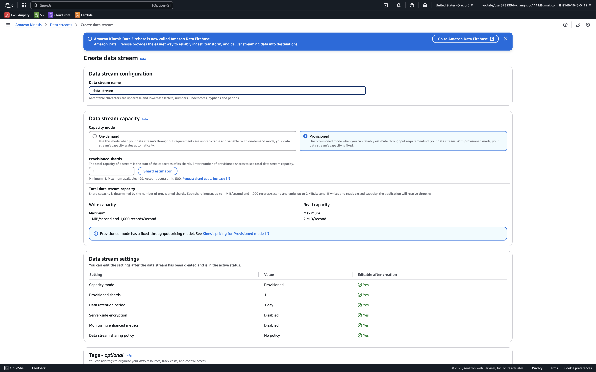
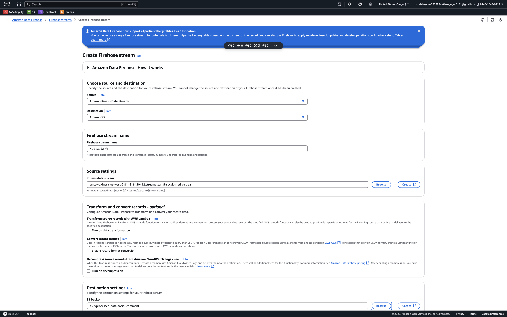
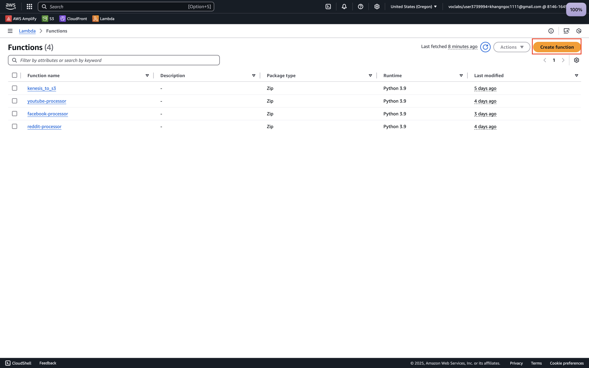
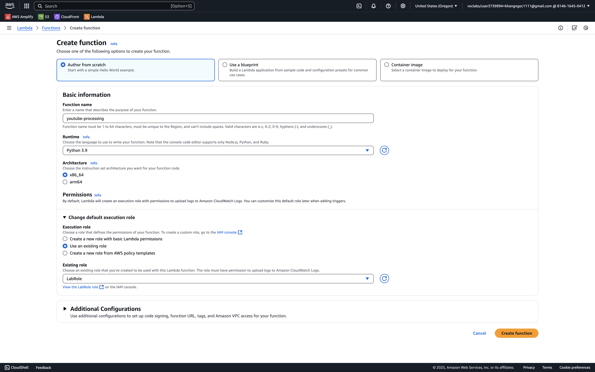
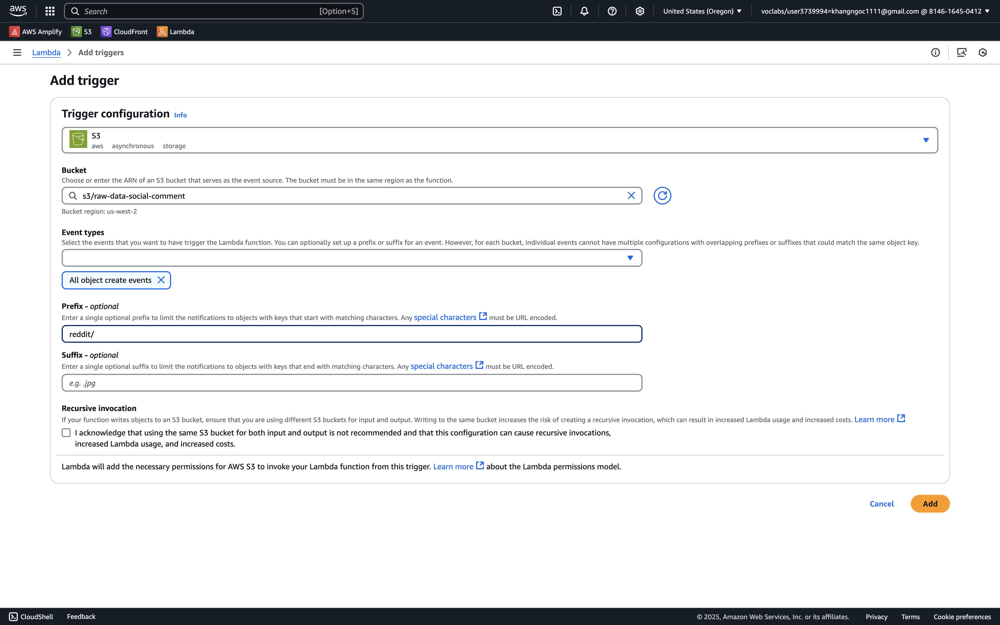
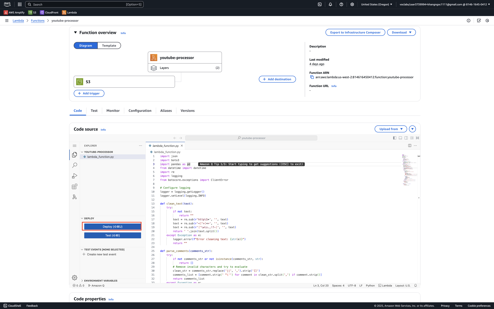
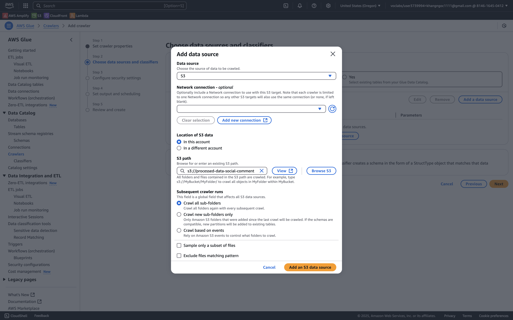
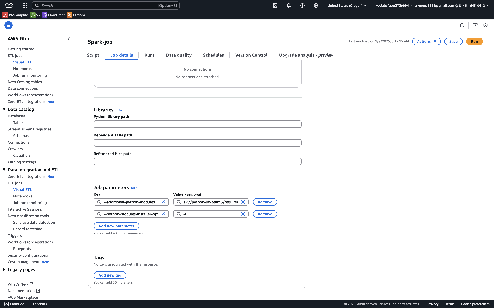

# EEET2574|EEET2615 Assessment 3: Social media data pipeline

S3927201 - Tran Ngoc Khang

S3891968 - Pham Vo Dong

S3927238 - Nguyen Gia Khanh

S3768999 - Sang-Hwa Jung

S3863973 - Tran Vinh Trong 

---

## Table of Contents

- [EEET2574|EEET2615 Assessment 3: Social media data pipeline](#eeet2574eeet2615-assessment-3-social-media-data-pipeline)
  - [Table of Contents](#table-of-contents)
  - [Overview](#overview)
  - [Folder Structure](#folder-structure)
  - [Data Sources](#data-sources)
  - [Setup](#setup)
  - [Infrastructure setup](#infrastructure-setup)
    - [AWS S3 buckets](#aws-s3-buckets)
    - [AWS Kinesis](#aws-kinesis)
    - [AWS Lambda function](#aws-lambda-function)
    - [AWS Glue](#aws-glue)
  - [Running the Project](#running-the-project)

## Overview

The project is structured into several components:

1. **Data Streaming**:
   - Crawlers for Facebook, Reddit, and YouTube to collect raw social media data.
   - Upload scripts for sending data to S3.
2. **Glue**:

   - Transformations and ETL jobs for processing data.

3. **Lambda Functions**:

   - Functions that process, filter, and enrich the data, including sentiment analysis and formatting for further use.

4. **Utils**:
   - Utility scripts for data formatting and Kinesis producer for streaming data.

The pipeline ingests data from social media platforms, processes it using AWS Lambda, analyzes sentiment using local scripts, and stores the results in S3 buckets for further use or analysis.

## Folder Structure

Here is an overview of the project structure:

```
├── README.md
│
├── data/
│   ├── fb_data.csv
│   ├── reddit_data.csv
│   └── youtube_data.csv
│
├── DataStreaming/
│   │
│   ├── Facebook/
│   │     ├── crawler.py
│   │     ├── README.md
│   │     └── requirements.txt
│   │
│   ├── Reddit/
│   │   ├── crawler.py
│   │   ├── README.md
│   │   ├── requirements.txt
│   │   └── upload_reddit_data.py
│   │
│   └── Youtube/
│      ├── crawler.py
│      ├── README.md
│      ├── requirements.txt
│      └── upload_youtube_data.py
│
├── Glue/
│   ├── job.py
│   ├── README.md
│   └── requirements.txt
│
├── LambdaFunction/
│   ├── kenesis_to_s3.py
│   ├── README.md
│   ├── reddit_proccessor.py
│   ├── requirements.txt
│   └── youtube_processor.py
│
└── utils/
    ├── data_formatter.py
    └── kinesis-producer.py

```

## Data Sources

- **Facebook Data**: Collected through a Facebook crawler. The data is stored in CSV files under the `data` directory.
- **Reddit Data**: Collected through a Reddit crawler. The raw data is stored in CSV files and processed via Lambda.
- **YouTube Data**: YouTube video data is collected and stored in CSV format. The YouTube data includes video details and comments.

## Setup

Before running the project, make sure you have the following:

1. **AWS Account**: You need an AWS account to use services like Lambda, Kinesis, and S3.
2. **AWS CLI**: Make sure the AWS CLI is installed and configured with your credentials.
3. **Python 3.x**: Ensure you have Python 3.x installed along with pip for managing dependencies.

## Infrastructure setup

### AWS S3 buckets

Create three essential S3 buckets

```
├── raw-data-social-comment         # Store raw dataset
│   ├── youtube
|   ├── facebook
|   └── reddit
├── processed-data-social-comment   # Store processing data
├── python-lib-team5                # Store requirement package for AWS Glue
|   └── requirement.txt
```

**Note**
Add [requirement.txt](./Glue/requirements.txt) from Glue to the `python-lib-team5` for installing essential python packages

### AWS Kinesis

Create Kinesis Data Stream:

- Navigate to AWS Kinesis console
- Click "Create data stream"
- Set stream name: "social-media-stream"
- Configure capacity mode: "On-provision"
- Click "Create data stream"



Create Kinesis Firehose:

- In the AWS Kinesis console, select "Delivery streams"
- Click "Create delivery stream"
- Configure source:
  - Source: Amazon Kinesis Data Streams
  - Select the stream created above ("social-media-stream")
- Configure destination:
  - Destination: Amazon S3
  - Select your processed data bucket
  - Set buffer size: 1 MB
  - Buffer interval: 60 seconds
- Click "Create delivery stream"



### AWS Lambda function

Create 3 Lambda function for data processing **`youtube-processing`**, **`reddit-processing`**, **`facebook-processing`**

**Instruction**
Access to the lambda function on AWS, click on the `Create function` button


Then configure the lambda suitable with the processor


Add trigger with AWS S3, select the bucket **`raw-data-social-comment`**, prefix is the source of the data for trigger the function


Copy the code of processor in [LambdaFunction folder](./LambdaFunction/). _Use the correct processor with the data source_. And run deploy the code of lambda


Create 1 Lambda function for data processing as same as with process lambda, but the trigger is kinesis and the code of lambda from [kinesis_to_s3](/LambdaFunction/kenesis_to_s3.py)

### AWS Glue

1. Create Glue Crawler:
   - Go to AWS Glue console
   - Click "Crawlers" then "Create crawler"
   - Set crawler name and description
   - For data source:
     - Choose "S3" as the source type
     - Select the raw data bucket path "processed-data-social-comment "
     - Choose "Crawl all sub-folders"



2.  Create Glue Job:

    - Navigate to "Jobs" in AWS Glue console
    - Click "Create job"
    - Configure job properties:
      - Name: "social-media-etl"
      - IAM Role: Select role with Glue permissions
      - Type: Spark
      - Glue version: 5.0
      - Language: Python
    - In Job detail choose advanced properties:

           - Job parameters

      ```
      Key: --additional-python-modules
      Value: s3://python-lib-team5/requirements.txt

      Key: --python-modules-installer-option
      Value: -r
      ```



    - Upload the job script from [job.py](./Glue/job.py)
    - Click "Create job"

3.  Run the Crawler:

    - Select your created crawler
    - Click "Run crawler"
    - Wait for crawler to complete
    - Check the created tables in Glue Data Catalog

4.  Run the Glue Job:
    - Navigate to the created job
    - Click "Run job"
    - Monitor execution in the job run details page

## Running the Project

The project consists of multiple components. Here's how you can run each part:

1. **Data Crawlers** (Facebook, Reddit, YouTube):

   - Navigate to the respective platform's folder (e.g., `DataStreaming/Facebook`).
   - Run the `crawler.py` to collect the data.

2. **Visualization**

Mongo chart link: https://charts.mongodb.com/charts-project-0-knfqvla/public/dashboards/677e3e29-59d8-41d2-8c0c-1356b25d3341
